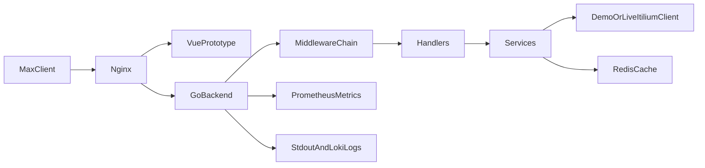

# System Overview

## Project Structure
- `cmd/bot` - main HTTP entrypoint for the MAX Mini App backend
- `cmd/worker` - placeholder entrypoint for background jobs
- `internal/handlers` - HTTP endpoints and route wiring
- `internal/services` - business logic and validation
- `internal/repository` - repositories and cache adapters
- `internal/models` - request and response structures
- `internal/api` - ITILIUM client implementations
- `internal/middleware` - request id, identity, metrics, logging, panic recovery
- `internal/config` - YAML and environment config loading
- `internal/logger` - structured logger construction
- `internal/container` - composition root for dependency injection
- `frontend` - static prototype and future Vue 3 application
- `deploy` - nginx, observability and mounted config files
- `migrations` - SQL migrations kept as a development/tooling scaffold until persistent storage is introduced
- `documentation` - architecture and operational docs

## Architecture

## Runtime Flow
1. The user opens the MAX Mini App URL through MAX.
2. Nginx serves the frontend and proxies `/api/*` requests to the Go backend.
3. The backend middleware chain attaches:
   - `request_id`
   - `user_id`
   - logging
   - metrics
   - panic protection
4. The handler validates and decodes the request.
5. The handler calls a service interface.
6. The service orchestrates:
   - in-memory profile reads and writes
   - Redis cache
   - ITILIUM API client calls
7. The result comes back as a unified JSON response with `requestId`.

## Logging Strategy
- Every HTTP request logs:
  - request id
  - user id
  - path
  - status code
  - latency
- Every ITILIUM call logs:
  - method
  - URL
  - request body
  - response status
  - response body
  - latency
- Logs are written to stdout for `docker logs` visibility.
- Docker logging driver forwards the same logs to Loki.

## Metrics Strategy
- `/metrics` exposes Prometheus metrics.
- HTTP request count and latency are tracked by middleware.
- Additional ITILIUM and Redis metrics should be added as business functionality grows.

## Current Scaffold Notes
- The backend uses a `DemoClient` while `app.dev.yml` keeps `demo_mode: true`.
- Redis is optional at runtime and degrades gracefully when unavailable.
- The project is ready to switch to the real ITILIUM client by filling `ITILIUM_*` config and turning off demo mode.
- Postgres is not part of the current production runtime; user profile snapshots are stored in memory and real state is read from ITILIUM.
