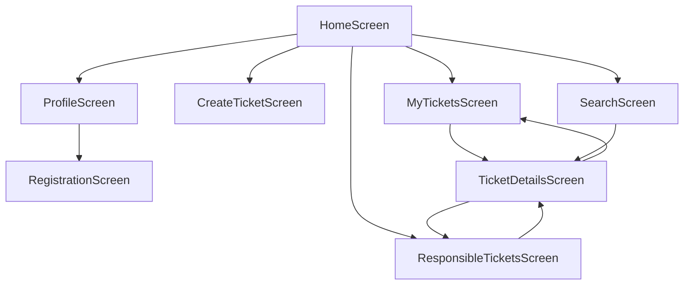
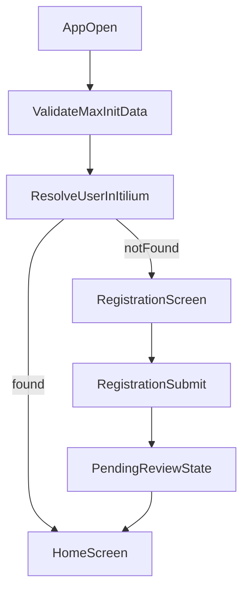
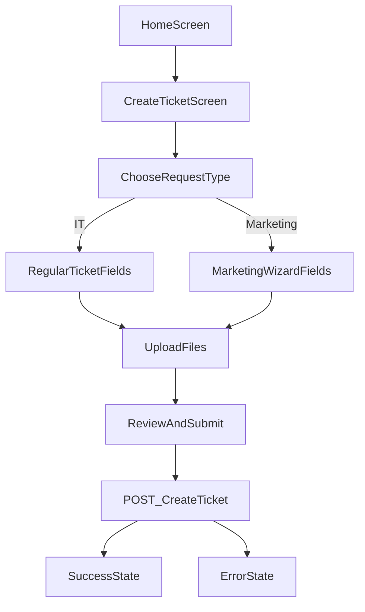
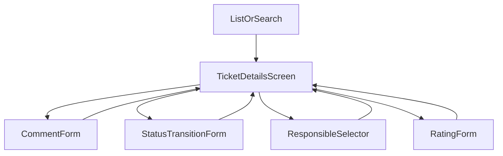

# UI Flows And Block Schemes

## Purpose
This document explains how the MAX Mini App screens relate to each other and how the main user journeys will work after the static prototype is connected to the backend.

## Screen Inventory
- `home` - start page and quick navigation hub
- `profile` - MAX profile and ITILIUM resolution status
- `registration` - form shown when the user is not found in ITILIUM
- `create` - regular or marketing request creation form
- `myTickets` - current user's ticket list
- `responsible` - tickets assigned to the current user
- `search` - direct search by ticket number
- `details` - ticket details, comments and workflow actions

## Global Navigation Flow

## Boot Flow

## Ticket Creation Flow

## Ticket Detail Flow

## Screen Responsibilities

### Home
- Shows summary metrics and entry points to all core scenarios.
- Hosts visual examples of `loading`, `empty`, `error` and `success` states.

### Profile
- Shows the MAX user identity.
- Displays whether the user is already linked to an ITILIUM employee.
- Redirects to registration if no employee was found.

### Registration
- Collects user identity data.
- Will later call the backend registration route.
- Ends in a pending or success state.

### Create Ticket
- Chooses the request type.
- Collects text fields and attachments.
- Will later open marketing-specific fields dynamically.
- Shows submission feedback after the backend call.

### My Tickets
- Displays the current user's own requests.
- Contains list cards and pagination controls.
- Opens the detail page on card click.

### Responsible Tickets
- Displays tasks where the user is the responsible person.
- Reuses the same card pattern as the personal ticket list.

### Search
- Performs quick lookup by ticket number.
- Redirects to the detail page after a successful search.

### Ticket Details
- Shows main ticket data.
- Hosts the action area:
  - add comment
  - change status
  - change responsible
  - confirm result
- Shows the event timeline that will later be built from API data.

## Frontend Event Notes
- Clicking a button in the prototype changes only `activeScreen` or `submitBanner`.
- After backend integration the same events will trigger composables or API service calls.
- The current prototype intentionally keeps transitions simple so the page map is easy to review with the customer.
